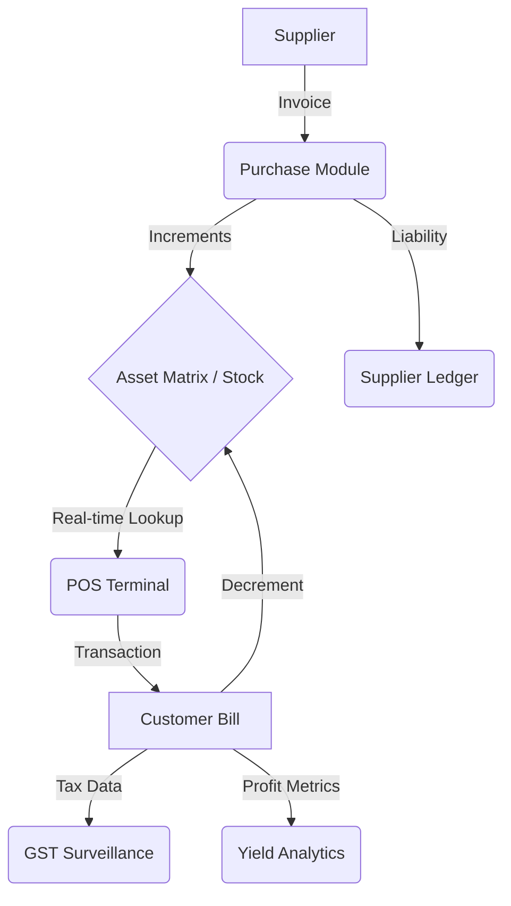

# ElectroERP: Vanguard System Architecture & Data Flow

This document outlines the technical architecture, core logic, and data propagation pathways of the ElectroERP system.

## 🏗️ Technical Stack

- **Frontend**: React (Vite) + Tailwind CSS + Lucide Icons
- **Backend**: Node.js + Express + Mongoose
- **Database**: MongoDB (Atlas/Local)
- **Authentication**: JWT (JSON Web Tokens) with Secure Cookie Storage

---

## 🛰️ 1. Core Data Flow Diagram

The following diagram represents how data moves from a raw Acquisition (Purchase) to Inventory and finally to a Transmission (Sale).

---

## ⚡ 2. Module Interactions

### A. Acquisition Protocol (Purchases)
When a **Purchase** is initialized:
1. **Purchase Entity**: Created in the database with line-item details.
2. **Stock Update**: `Product.stockQty` is incremented for each item.
3. **Ledger entry**: A `CREDIT` entry is added to the `SupplierLedger`.
4. **GST Ledger**: An `INPUT` tax entry is recorded for tax credit tracking.

### B. Transmission Protocol (Sales/Billing)
When a **Sale** is conducted:
1. **Bill Entity**: Generated with a unique cryptographic sequence.
2. **Stock Update**: `Product.stockQty` is decremented.
3. **GST Ledger**: An `OUTPUT` tax entry is recorded.
4. **Activity Log**: The event is anchored in the security surveillance trail.

---

## 📊 3. Data Visualization Map

The **Vanguard Control Center** uses a modular visualization system to provide "Mission Control" over the business:

- **Revenue Evolution**: A temporal analysis of grand totals from the `Bill` module.
- **Yield Extraction**: Net profit margin calculated from `(Selling Price - Cost Price) * Qty`.
- **Resource Depletion**: Real-time alerts triggered by `Product.minStockQty`.
- **Tax Surveillance**: Aggegration of `GSTLedger` data grouped by HSN protocols.

---

## 🔐 4. Authority Schema

Access is governed by the **Protocol Authority Layer**:
- **ADMIN**: Unrestricted access to system configuration and surveillance.
- **MANAGER**: Full operational access (Inventory, Suppliers, Analytics).
- **CASHIER**: High-speed access to the POS Terminal only.

---

## 🚀 System Readiness
The system is currently populated with **Vanguard High-Fidelity Data**, including historical trends for the last 30 days, allowing for immediate visualization of all analytics modules.
